# Metal-to-Cloud Telemetry: Fleet Orchestration & Monitoring

## Video Demo

**URL:** [YouTube]

This video (1–5 minutes) walks through the live dashboard, user flow, Docker/PostgreSQL/Swarm highlights, monitoring or health checks, and the **deployed** application URL in the browser.

---

## 1. Team Information

| Name | Student # | Email | Role |
| :--- | :--- | :--- | :--- |
| Hassan Mahdi | 1005985212 |hassan.mahdi@mail.utoronto.ca | Frontend Engineering |
| Yulong Sheng | 1011838843 | steve.sheng@mail.utoronto.ca | Backend & API Engineering |
| Yamoah Attafuah | 1012642954 | yamoah.attafuah@mail.utoronto.ca | Cloud DevOps & Orchestration |
| Samson Ajadalu | 1012365691 | s.ajadalu@mail.utoronto.ca | Robotics & Integration Lead |

---

## 2. Motivation

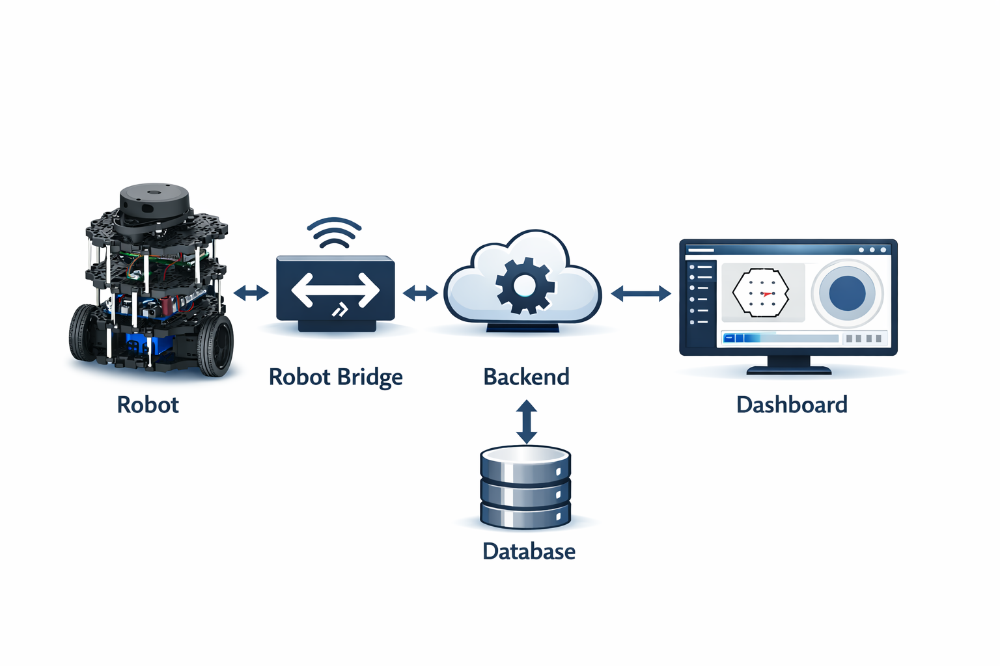

As robotics deploy in increasingly complex environments, the ability to monitor, debug, and control these systems remotely has become a critical bottleneck. Traditional robotics stacks often lack a simple, cloud-native path for real-time telemetry and persistent mission history. When a robot fails in the field, operators need to know exactly what happened leading up to the failure.

Our team chose this project to bridge the gap between edge robotics and cloud infrastructure. We built a "metal-to-cloud" pipeline that allows operators to view live telemetry from autonomous agents (both simulated and physical) and persist aggregate state in PostgreSQL so fleet metrics survive restarts. This system is designed for test engineers and robotics developers who require a low-latency, high-reliability connection to their fleet.

---

## 3. Objectives

Our primary goal was to create a robust, bidirectional data pipeline utilizing modern cloud orchestration. The specific objectives achieved include:

1. **Real-Time Streaming:** Implementing a low-latency WebSocket connection to stream live telemetry (pose, battery, status) from a ROS 2 agent to a cloud backend.
2. **Data Persistence:** Designing a reliable database architecture to store telemetry and per-robot aggregates (for example distance traveled and last-seen timestamps) so the cloud retains meaningful state after disconnects or container restarts.
3. **Operator Dashboard:** Developing a responsive web interface for live monitoring, a compact session or fleet summary backed by the database, and basic fleet command/control.
4. **Cloud-Native Orchestration:** Deploying the entire software stack using Docker Swarm to ensure high availability, easy scaling, and automated recovery.

---

## 4. Technical Stack

Our architecture is split into three main layers, entirely containerized and orchestrated via Docker Swarm.

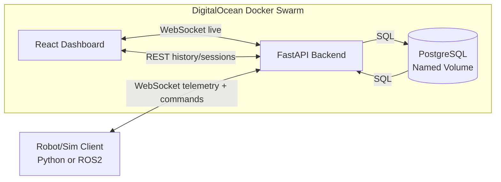

- **Frontend (UI):** React + TypeScript (built with Vite). Chosen for its component-based architecture, allowing us to build a modular, high-performance dashboard that handles rapid state changes from WebSocket streams.
- **Backend (API):** Python + FastAPI. Chosen for its native asynchronous support, which is essential for managing simultaneous REST requests and high-frequency WebSocket connections from multiple robots.
- **Database:** PostgreSQL 15. Chosen for its reliability and strong support for relational time-series data. Accessed via SQLAlchemy ORM.
- **Robotics Integration:** ROS 2 (Humble) + Gazebo. The industry standard for robotics simulation and message passing.
- **Orchestration & Cloud:** Docker Swarm on DigitalOcean Droplets.
  - *Why Swarm over Kubernetes?* For our specific timeline and fleet size, Docker Swarm provided the necessary high availability and replica management without the massive operational overhead of managing a full Kubernetes control plane. It allowed us to maintain configuration parity between local development (`docker compose`) and production deployment.

---

## 5. Features & Implementation

Our application fulfills the course requirements through the following features:

| Feature | Description | Course Requirement Fulfilled |
| :--- | :--- | :--- |
| **Live Telemetry Dashboard** | A real-time web interface displaying robot pose, battery life, and active status via WebSockets. | WebSockets (Advanced) & UI Development |
| **Persisted fleet & session summary** | The UI surfaces data loaded from PostgreSQL (for example per-robot distance covered, last seen, and session identifiers) to demonstrate that telemetry and aggregates are stored durably, not only streamed in memory. | PostgreSQL & Data Persistence |
| **Containerized Deployment** | The Frontend, Backend, and Database are all isolated in individual Docker containers. | Docker Containerization |
| **High-Availability Swarm** | The application is deployed across a DigitalOcean Docker Swarm, ensuring the API and UI remain available even if a node fails. | Orchestration (Swarm/K8s) |
| **Persistent Storage Volumes** | PostgreSQL utilizes named Docker volumes mounted to DigitalOcean Block Storage to ensure telemetry data survives container restarts. | Storage |

Line counts below use **`cloc . --exclude-dir=node_modules,build,dist`**. The breakdown focuses on **core authored code** (application logic, styling, DevOps config, and project Markdown). It **does not** count bulk static assets such as **SVG** icons or large **JSON** / **XML** environment payloads, so the total reflects engineering effort rather than vendor or generated bulk.

| Language / area | Files | Code lines |
| :--- | ---: | ---: |
| Python (backend, API, & ROS 2 bridge) | 21 | 2,204 |
| TypeScript (frontend dashboard) | 13 | 695 |
| CSS (application styling) | 3 | 1,337 |
| DevOps & config (YAML, Docker, shell) | 15 | 784 |
| Documentation (Markdown) | 10 | 1,287 |
| **Total (core logic)** | **62** | **6,307** |

Our project consists of **6,307** lines of code in this scope, covering core application logic, robotics integration, and cloud orchestration. Third-party libraries, build artifacts, and non-essential static assets are excluded for a fair picture of team contribution. Primary development was in **Python** and **TypeScript**.

---

## 6. User Guide

**Live Cloud Dashboard:** http://159.203.4.11:3000  
**Live Gazebo Simulation (noVNC):** http://138.197.132.226/vnc.html *(Credentials sent to TA via email)*

### Interacting with the Live Simulation

To demonstrate the "metal" edge of our pipeline, we are hosting a continuous Gazebo simulation on a dedicated VPS. You can view the live robot environment via our noVNC web interface at the link above. Telemetry from this simulation streams directly into our live cloud dashboard.

### Monitoring a Live Session

1. Open http://159.203.4.11:3000. The default view is the **Fleet Dashboard**.
2. If a robot is actively publishing data via the ROS 2 bridge, it will appear in the "Active Agents" list.
3. Click on a specific agent to view its real-time telemetry stream (Pose X/Y/Theta, Battery percentage).

### Viewing persisted storage (summary)

Open **Stored fleet** in the navigation (route **`/fleet-summary`**). View cumulative mission analytics and historical telemetry records retrieved from persistent storage (fleet table: distance covered, last seen, status, battery, and last position).

### Figures and screenshots


#### 1. Fleet operations (user interface)

These illustrate the live frontend and telemetry path.

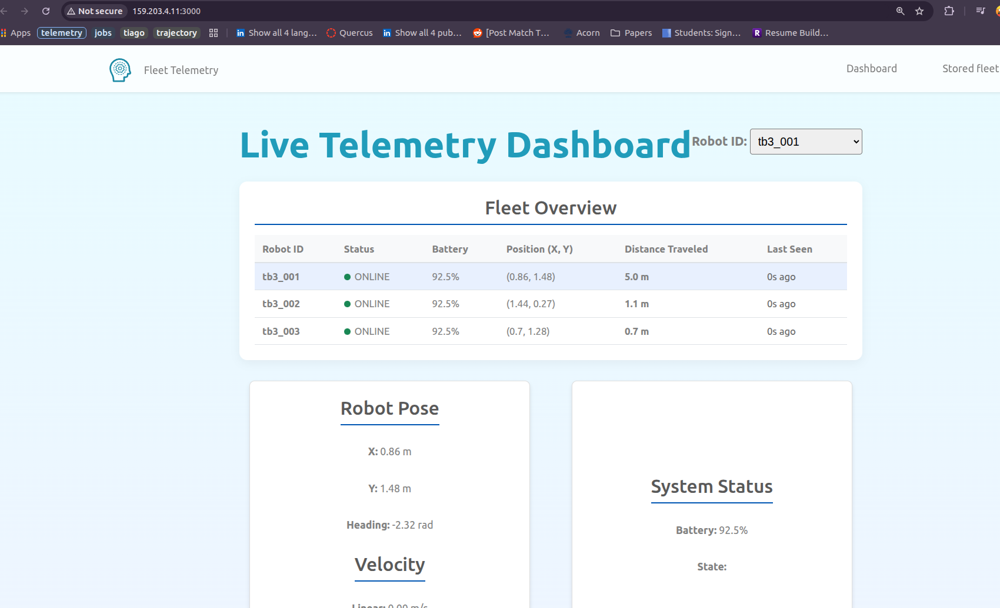

*Figure 1. Live fleet dashboard showing real-time telemetry (position, battery, distance) from multiple robots via the DigitalOcean production node.*

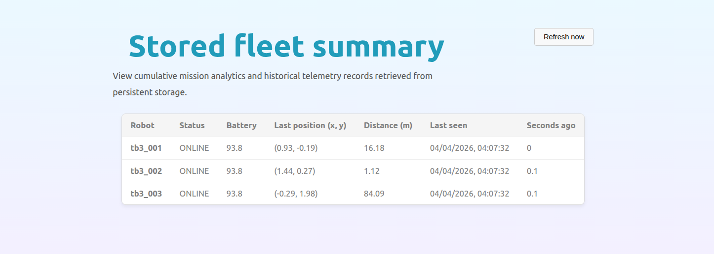

*Figure 2. Stored fleet mission registry (PostgreSQL). Cumulative mission metrics such as total distance and last-seen timestamps are persisted across system restarts.*

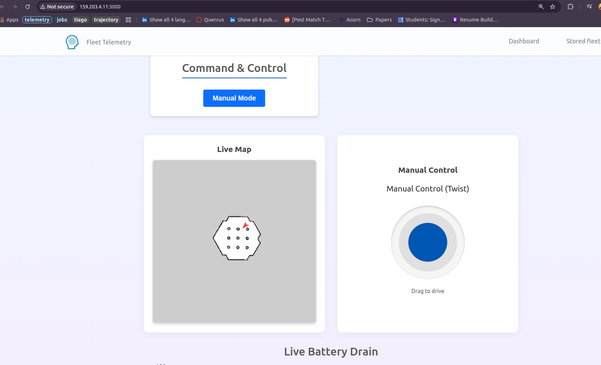

*Figure 3. Interactive command and control interface including a live Gazebo environment map and manual joystick controls for the robot fleet.*

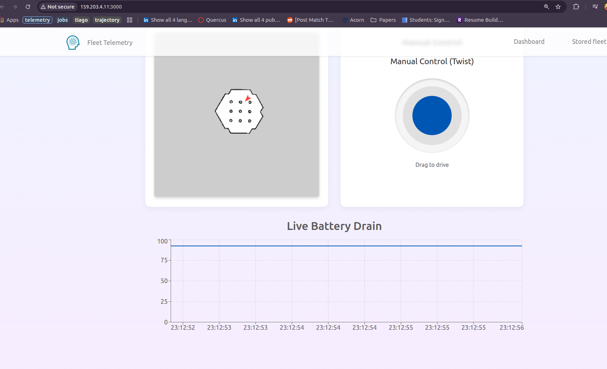

*Figure 4. Real-time telemetry analytics showing live battery drain metrics across the robot fleet for mission monitoring.*

#### 2. System infrastructure and monitoring

These illustrate DevOps, orchestration, and health checks.

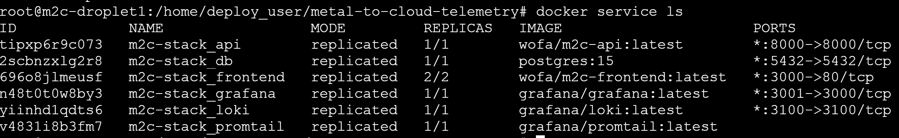

*Figure 5. Docker Swarm orchestration terminal output showing active services and load-balanced replicas for high availability.*

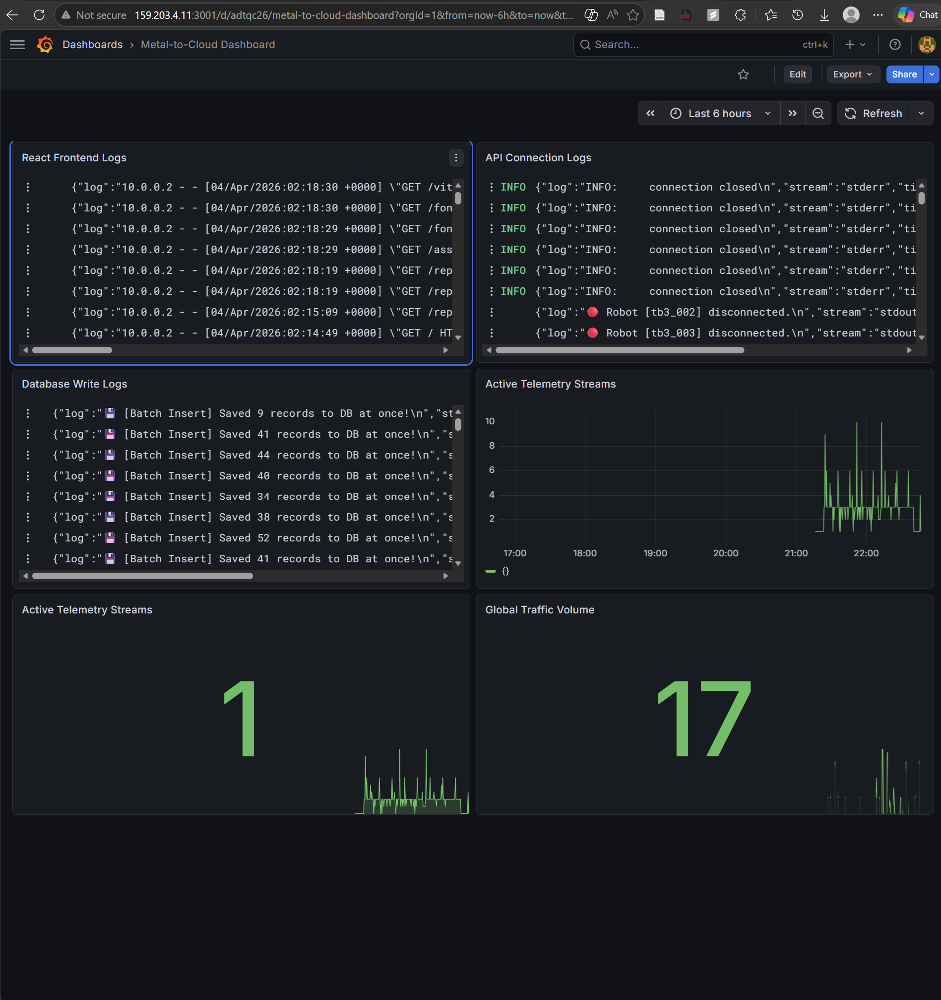

*Figure 6. Observability stack (Grafana and Loki) used for ingesting and visualizing containerized system logs across the swarm.*

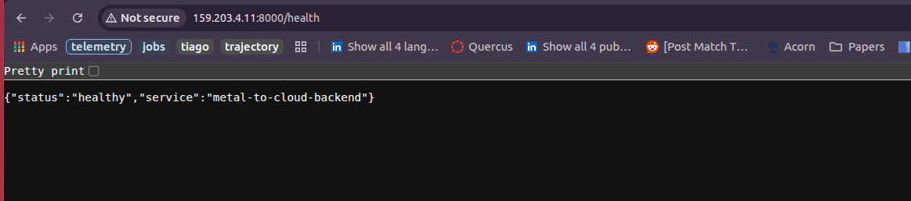

*Figure 7. Backend health monitoring: real-time JSON response from the `/health` endpoint, used to monitor service availability.*

#### 3. Cloud resource metrics (DigitalOcean)

These show multi-node operation: **Droplet 1** (manager) and **Droplet 2** (worker) as separate hosts in the Swarm.

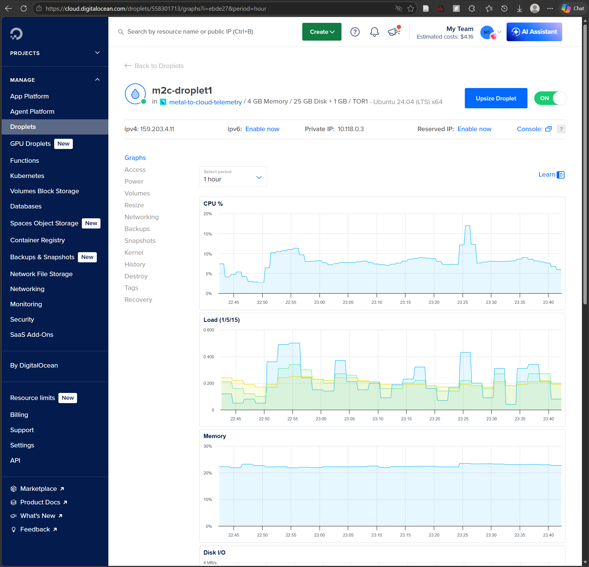

*Figure 8a. Infrastructure metrics for Droplet 1 (manager node), including CPU, load, and disk I/O.*

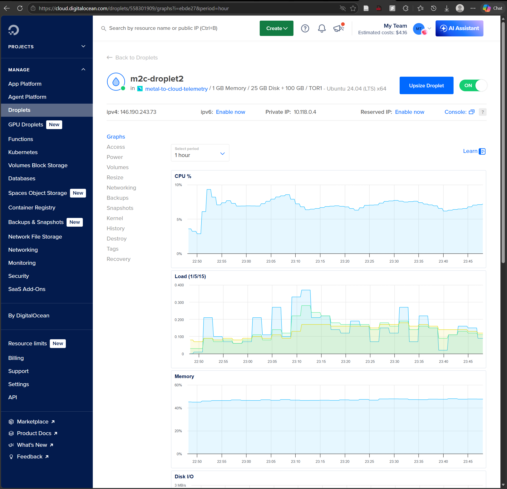

*Figure 8b. Infrastructure metrics for Droplet 2 (worker node), including bandwidth and memory usage for load-balanced services.*

**Tip (droplet metrics):** You can combine several DigitalOcean graphs into **one image per droplet** (8a / 8b), or keep a **single** clear panel (often CPU and bandwidth) per node so the report stays readable, as clarity beats volume.

---

## 7. Development Guide

### Environment Setup

1. Clone the repository: `git clone https://github.com/SamsonAjadalu/metal-to-cloud-telemetry.git`
2. Install Docker and Docker Compose on the development machine.
3. Copy environment templates for the ROS bridge (repo root):

   ```bash
   cp .env.telemetry.example .env.telemetry
   ```

   For the API, copy **`backend/.env.example`** as a reference and set **`DATABASE_URL`** (and any DB variables required by `compose.yaml`) in a repo-root **`.env`** or the shell, consistent with `backend/database.py` and the `db` service in `compose.yaml`.

   **Credentials sent to TA:** Any sensitive production credentials required beyond the templates in this repository were submitted to the TA.

   **CORS:** the FastAPI app allows only origins listed in **`CORS_ALLOW_ORIGINS`** (comma-separated *dashboard* origins). Local examples: `http://localhost:3000,http://localhost:5173`. Production example: `http://159.203.4.11:3000` (match the URL users type in the browser, `http` or `https` as deployed).

   **Frontend build:** set **`VITE_API_BASE_URL`** to the browser-reachable API origin (no trailing slash), e.g. `http://localhost:8000`, at build time (see **`frontend/.env.example`**).

### Local Execution (Full Stack)

To run the Database, Backend, and Frontend locally:

```bash
docker compose -f compose.yaml build
docker compose -f compose.yaml up -d
```

- With this repository’s `compose.yaml`, the UI is typically exposed on **`http://localhost:3000`** (container serves the built frontend).
- For Vite’s dev server (`npm run dev` inside `frontend/`), use **`http://localhost:5173`** instead.
- API interactive docs: **`http://localhost:8000/docs`**
- Liveness-style check: **`GET http://localhost:8000/health`** (and **`GET /status`**).

### ROS 2 bridge (optional local testing)

See **`TELEMETRY_README.md`** for ROS 2 Humble, `colcon build`, and `ros2 launch` instructions. Set **`BACKEND_BASE_URL`** in `.env.telemetry` to the running API (e.g. `ws://localhost:8000`).

### Database Management

On startup, SQLAlchemy automatically generates the required tables (`create_all`). To clear the database for testing:

```bash
docker compose down -v
docker compose up -d
```

---

## 8. Deployment Information

The production environment is split across two cloud providers to simulate a true edge-to-cloud architecture:

- **Edge Robotics Node (VPS):** Hosts the Gazebo simulation and ROS 2 telemetry bridge. Accessible via noVNC at http://138.197.132.226/vnc.html *(Credentials sent to TA via email)*.
- **Cloud Swarm (DigitalOcean):** Hosts the production Docker Swarm (Frontend, Backend, and Database).
- **Live dashboard:** http://159.203.4.11:3000
- **Backend API base:** http://159.203.4.11:8000 (REST and WebSocket entry point for the dashboard)
- **Environment:** Production **`.env`** (or secrets) should set **`CORS_ALLOW_ORIGINS`** to include **`http://159.203.4.11:3000`** (or your final public UI origin). The frontend image build must receive **`VITE_API_BASE_URL=http://159.203.4.11:8000`** (or the matching public API URL) at build time (see CI **`DROPLET_IP`** wiring in **`.github/workflows/deploy.yml`**).
- **Deployment Mechanism:** We utilize GitHub Actions for CI/CD. Pushing to the `prod` branch triggers a workflow that builds the updated Docker images, pushes them to the registry, and executes a `docker service update` command via SSH to our Swarm manager node.

---

## 9. Individual Contributions

- **Hassan Mahdi:** Led the frontend development. Designed the React component architecture, implemented the WebSocket client for real-time data ingestion, and built the UI layout. *(See Git history under `frontend/`.)*
- **Yulong Sheng:** Architected the FastAPI backend. Implemented high-performance Data Persistence using an in-memory buffer and asynchronous batch commits to PostgreSQL to prevent I/O locking. Designed the 'Agnostic Routing' WebSocket architecture to act as a transparent proxy, ensuring sub-millisecond latency for live telemetry and Target Commands. (See Git history under backend/.)*
- **Yamoah Attafuah:** Managed Cloud Ops. Wrote the Dockerfiles, configured the `compose.yaml` for Swarm deployment, set up the DigitalOcean infrastructure, implemented the GitHub Actions CI/CD pipeline, secrets management with Docker Secrets and custom monitoring and observability stack with Grafana, Loki and Promtail. *(See Git history in the repository root and `.github/`.)*
- **Samson Ajadalu:** Developed the robotics telemetry bridge. Wrote the Python nodes in ROS 2 to extract data from Gazebo/TurtleBot3 and stream it to the cloud backend. Handled full-stack integration by debugging WebSocket connections and fixing CORS policy errors between the frontend and API. Also authored the project's open-source documentation, including the main README and contribution guidelines.

---

## 10. AI Assistance & Verification (Summary)

Our team used AI tools primarily as a development assistant to help explore architectural options (Docker Swarm deployment) and debug complex integrations (ROS 2 to FastAPI WebSocket connections). We critically evaluated all AI-generated suggestions to ensure they met strict production standards before integrating them into our codebase.

**Specifically:**

- **Where AI contributed:** It provided troubleshooting steps for network isolation errors between Swarm nodes.
- **Representative mistake:** The AI incorrectly suggested using a wildcard (`*`) for our production CORS configuration. We recognized that this was a severe security risk that would also break our credential-passing requirements in modern browsers.
- **How correctness was verified:** We identified the CORS flaw through manual security inspection and browser network logs, replacing it with a strict IP whitelist. Throughout the project, we validated all AI suggestions by running local `docker compose` integration tests, monitoring `docker service` logs, and verifying hardware resource usage in Grafana.

Please see **`ai-session.md`** in the repository root for the prompts and our full correction process for these interactions.

---

## 11. Lessons Learned

This project provided invaluable experience in full-stack cloud orchestration. The biggest technical hurdle was ensuring the reliability of WebSockets across a distributed Docker Swarm. We learned that while WebSockets are excellent for real-time local data, maintaining persistent connections through cloud load balancers requires careful configuration of timeouts and reconnect logic. Additionally, transitioning from local `docker compose` to a cloud Swarm highlighted the importance of environment variables and strict network isolation. Ultimately, we achieved our goal of building a robust bridge between local robotic hardware and cloud infrastructure.
